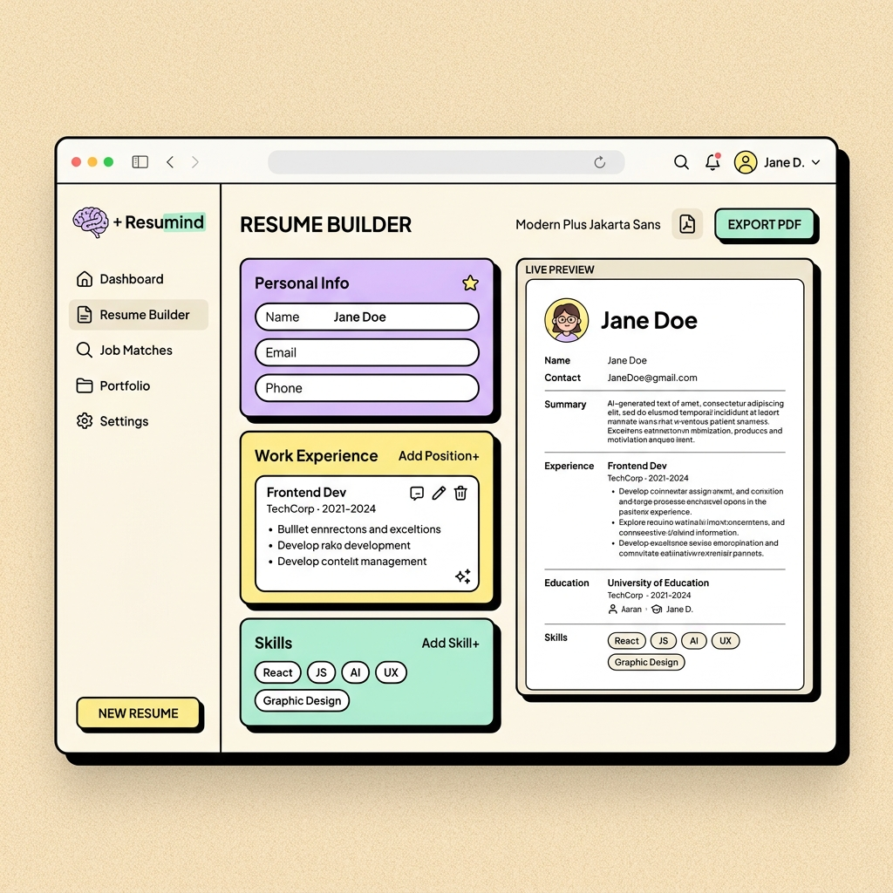

# ⚡ AI Resume & Cover Letter Builder (Resumind)

Aplikasi Pembuat CV otomatis ATS-Friendly dan Surat Lamaran Kerja berbasis kecerdasan buatan (AI) Google Gemini, dibalut dengan estetika desain **Kartun Neobrutalism** yang playful, berani, tebal, dan sangat interaktif!

<div align="center">
  
</div>

---

## 🎨 Fitur Unggulan

*   **👾 Desain Kartun Neobrutalism**: Tampilan UI/UX modern berani dengan garis luar (border) tebal hitam solid, warna-warna pastel ceria, dan micro-interaction tombol 3D fisik yang sangat memuaskan saat ditekan.
*   **📄 Real-time Live CV Preview**: Perubahan data pada form editor langsung ter-update secara instan pada kertas simulasi A4 di sebelah kanan.
*   **📑 10+ Template Profesional & Variasi Font**: Ganti tema layout (ATS Klasik, Minimalis, Eksekutif, Kreatif, dll.) dan jenis tipografi tulisan secara instan hanya dalam satu klik.
*   **🚀 AI Work Experience Enhancer (STAR Method)**: Optimalkan deskripsi pengalaman kerja Anda menggunakan kecerdasan buatan Google Gemini dengan format STAR (Situation, Task, Action, Result) otomatis.
*   **✉️ AI Cover Letter Generator**: Hasilkan Surat Lamaran Kerja resmi yang disesuaikan secara khusus dengan data CV Anda dan posisi pekerjaan tujuan Anda.
*   **🛠️ Direct Paper Editing**: Anda dapat mengedit isi teks Surat Lamaran langsung di atas lembaran kertas simulasi sebelum dicetak.
*   **🖨️ Cetak & Unduh PDF Bersih**: Fitur unduh file PDF tetap menjaga kertas berlatar belakang putih bersih dengan teks hitam tegas formal, otomatis menyembunyikan semua elemen navigasi aplikasi.
*   **🔍 SEO-Optimized**: Struktur semantik HTML5, metadata Open Graph, pratinjau tautan WhatsApp/LinkedIn yang mewah, serta performa super cepat.

---

## 💻 Tech Stack

*   **Core**: React (v19) + Vite (v8)
*   **Styling**: Pure CSS Vanilla (Sistem Desain Neobrutalism dengan CSS Custom Variables)
*   **Icons**: Lucide React
*   **PDF Compiler**: HTML2PDF.js (kombinasi HTML2Canvas & jsPDF)

---

## ⚙️ Panduan Instalasi & Jalankan Lokal

Ikuti langkah-langkah mudah di bawah ini untuk menjalankan aplikasi ini di komputer Anda sendiri:

### 1. Prasyarat
Pastikan komputer Anda sudah terinstal [Node.js](https://nodejs.org/) (versi 18 ke atas direkomendasikan).

### 2. Kloning Repositori
Buka terminal Anda, lalu jalankan perintah:
```bash
git clone https://github.com/maulaknatt/AI-resume-builder.git
cd AI-resume-builder
```

### 3. Instal Dependensi
Pasang semua paket library yang dibutuhkan menggunakan npm:
```bash
npm install
```

### 4. Konfigurasi Environment (.env)
1. Buat berkas baru bernama `.env` di direktori utama proyek.
2. Tambahkan variabel kunci API Google Gemini Anda:
   ```env
   VITE_GEMINI_API_KEY=isi-dengan-api-key-gemini-anda
   ```
   *(Catatan: Anda dapat memperoleh Google Gemini API Key secara gratis lewat [Google AI Studio](https://aistudio.google.com/))*

### 5. Jalankan Server Lokal (Development)
Jalankan perintah berikut untuk memulai server lokal:
```bash
npm run dev
```
Setelah berhasil, buka peramban (browser) Anda dan akses alamat:
`http://localhost:5173/`

### 6. Build untuk Produksi
Apabila ingin mengompilasi aplikasi ke dalam folder siap rilis (`dist`):
```bash
npm run build
```

---

## 🌟 Lisensi & Kredit

Dibuat dengan ♥ oleh [**@maulana bagus**](https://github.com/maulaknatt/)
